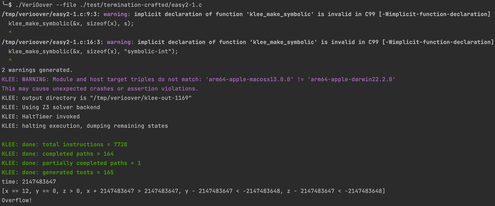

# VeriOover
## Introduction

VeriOover is a verifier for detecting integer overflow.

## Dependency

- Python 3.8.9

- Klee 2.3
- llvm 13.0.1
- pycparser 2.21
- PyYAML 6.0

## Installation

### Python packages

```
pip install pycparser
pip install pyyaml
```

### LLVM

Download from the llvm website https://releases.llvm.org/download.html#13.0.1

### KLEE

Refer to official website to install KLEE: http://klee.github.io/getting-started/

## Usage

```bash
usage: VeriOover [-h] [--file FILE] [--version]

Overflow Verifier.

optional arguments:
  -h, --help   show this help message and exit
  --file FILE  Input file path
  --version    show program's version number and exit
```

### Example

```bash
./VeriOover --file /path/to/file
```




## Authors

This project is the implementation of the paper VeriOover: A Verifier for Detecting Integer Overflow by Loop Abstraction by Jian Fang, Haipeng Qu, et al.
